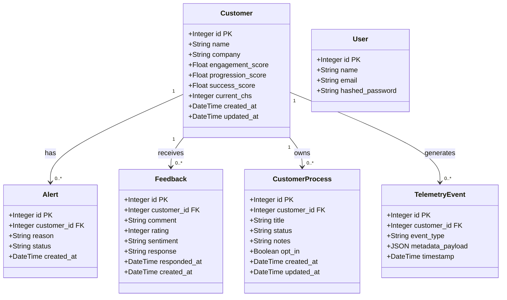

# Projeto SENSE - MVP

O **SENSE** é um sistema de inteligência de dados projetado para o ecossistema do SEBRAE-PE. Seu objetivo central é monitorar a jornada do cliente utilizando o **Customer Health Score (CHS)** de forma preditiva, identificando riscos de abandono (churn) e priorizando o atendimento da equipe de Customer Experience (CX) através de um dashboard intuitivo e reativo.

## 🏗 Estrutura do Projeto

A arquitetura do projeto foi pensada para ser enxuta e performática, dividida em:

*   **`backend/`**: API construída em Python utilizando o **FastAPI**. Lida com o processamento dos sinais digitais, cálculo de score (CHS) em segundo plano e integração com o banco de dados. Utiliza o SQLAlchemy como ORM.
*   **`frontend/`**: Aplicação Single Page Application (SPA) para o dashboard do analista de CX. Construída com **React**, empacotada via **Vite** para máxima velocidade, e estilizada com **Tailwind CSS v4**. Utiliza `lucide-react` para ícones e `recharts` para gráficos.
*   **Banco de Dados**: Utilizamos o **PostgreSQL** como fonte única de verdade para armazenar perfis, eventos da linha do tempo e a fila de atendimento. Um ambiente local é facilmente gerado via Docker Compose.

---

## 🧱 Arquitetura em Camadas

O sistema segue o padrão de arquitetura em camadas. Abaixo, o fluxo completo do caso de uso **Criar Feedback**:

```mermaid
flowchart TD
  A([Usuário]) -->|POST /api/customers/{id}/feedback| B

  subgraph L1 [Camada de Apresentação / Roteamento]
    B[Router\nrouters/customers.py] -->|valida payload| C[Schema Pydantic\nFeedbackCreate]
  end

  L1 -->|chama create_feedback| L2

  subgraph L2 [Camada de Lógica de Negócio]
    D[Análise de sentimento\npositive / neutral / negative] --> E[Regras de negócio\nCHS –15 se negativo]
    E -->|se negativo| F[Cria Alert]
  end

  L2 -->|persiste| L3

  subgraph L3 [Camada de Acesso a Dados - SQLAlchemy ORM]
    G[Model Feedback] -->|FK| H[Model Customer\ncurrent_chs atualizado]
  end

  L3 -->|db.commit| DB[(PostgreSQL\nfeedbacks · customers · alerts)]
  DB -->|FeedbackResponse JSON| A
```

---

## 🗂 Diagrama de Classes

Abaixo o modelo de entidades do sistema e seus relacionamentos:



---

## 🚀 Como iniciar o projeto localmente

Para rodar este projeto em sua máquina local, você precisará ter instalado:
*   [Docker Desktop](https://www.docker.com/products/docker-desktop/) (para o banco de dados)
*   [Node.js](https://nodejs.org/) (versão 18+ para rodar o frontend)
*   [Python](https://www.python.org/downloads/) (versão 3.9+ para rodar o backend)

Siga os passos abaixo na ordem apresentada:

### 1. Iniciando o Banco de Dados
Na raiz do projeto, inicie o contêiner do PostgreSQL utilizando o Docker Compose:
```bash
docker-compose up -d
```
> O banco de dados estará rodando na porta `5432` com usuário `sense_user` e senha `sense_password`.

### 2. Iniciando o Backend (API)
Abra um terminal e acesse a pasta `backend`.
Crie um ambiente virtual (recomendado) e instale as dependências:
```bash
cd backend
python -m venv venv

# Ative o ambiente virtual (no Windows):
venv\Scripts\activate
# No Linux/Mac: source venv/bin/activate

pip install -r requirements.txt
```
Inicie o servidor de desenvolvimento:
```bash
uvicorn main:app --reload
```
> A API estará disponível em: `http://localhost:8000`
> O Swagger UI para testar as rotas da API pode ser acessado em: `http://localhost:8000/docs`

### 3. Iniciando o Frontend (Dashboard)
Abra outro terminal e acesse a pasta `frontend`.
Instale as dependências Node e inicie o Vite:
```bash
cd frontend
npm install
npm run dev
```
> O Dashboard estará disponível em: `http://localhost:5173`

---

## 🤝 Como contribuir

Se você faz parte da equipe de desenvolvimento e vai atuar no SENSE, siga estas diretrizes básicas:

1. **Branches:** Crie branches a partir da `main` com nomes descritivos. Exemplos:
   - `feat/novo-dashboard` (para novas funcionalidades)
   - `fix/calculo-chs` (para correções de bugs)
   - `refactor/api-rotas` (para refatorações de código)

2. **Padrão de Commits:** Procure utilizar mensagens claras e diretas sobre o que foi alterado. Exemplo: `"feat: adicionado gráfico de linha no dashboard"`.

3. **Backend:** Ao adicionar novos pacotes Python, lembre-se de atualizar o `requirements.txt` usando o comando `pip freeze > requirements.txt` (tomando o cuidado de manter as dependências limpas) ou editando manualmente.

4. **Frontend:** Adicione componentes reutilizáveis dentro da pasta `src/components/` e mantenha a organização modular da interface.

## 📄 Documentação Técnica

Para mais detalhes sobre as regras de negócio, cálculo de Customer Health Score e a visão estratégica do produto, consulte o arquivo de documentação [Estrutura_MVP_Sense.md](./Estrutura_MVP_Sense.md) presente neste repositório.