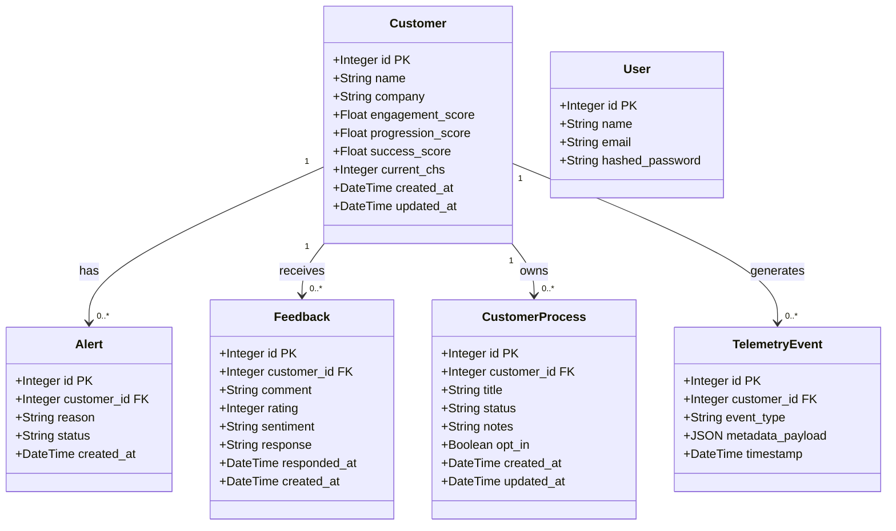

# Projeto SENSE - MVP

O **SENSE** é um sistema de inteligência de dados projetado para o ecossistema do SEBRAE-PE. Seu objetivo central é monitorar a jornada do cliente utilizando o **Customer Health Score (CHS)** de forma preditiva, identificando riscos de abandono (churn) e priorizando o atendimento da equipe de Customer Experience (CX) através de um dashboard intuitivo e reativo.

## 🏗 Estrutura do Projeto

A arquitetura do projeto foi pensada para ser enxuta e performática, dividida em:

*   **`backend/`**: API construída em Python utilizando o **FastAPI**. Lida com o processamento dos sinais digitais, cálculo de score (CHS) em segundo plano e integração com o banco de dados. Utiliza o SQLAlchemy como ORM.
*   **`frontend/`**: Aplicação Single Page Application (SPA) para o dashboard do analista de CX. Construída com **React**, empacotada via **Vite** para máxima velocidade, e estilizada com **Tailwind CSS v4**. Utiliza `lucide-react` para ícones e `recharts` para gráficos.
*   **Banco de Dados**: Utilizamos o **PostgreSQL** como fonte única de verdade para armazenar perfis, eventos da linha do tempo e a fila de atendimento. Um ambiente local é facilmente gerado via Docker Compose.

---

## 🧱 Arquitetura em Camadas

O sistema segue o padrão de arquitetura em camadas. Abaixo, o fluxo completo do caso de uso **Criar Feedback**:

```mermaid
flowchart TD
  A([Usuário]) -->|POST /api/customers/{id}/feedback| B

  subgraph L1 [Camada de Apresentação / Roteamento]
    B[Router\nrouters/customers.py] -->|valida payload| C[Schema Pydantic\nFeedbackCreate]
  end

  L1 -->|chama create_feedback| L2

  subgraph L2 [Camada de Lógica de Negócio]
    D[Análise de sentimento\npositive / neutral / negative] --> E[Regras de negócio\nCHS –15 se negativo]
    E -->|se negativo| F[Cria Alert]
  end

  L2 -->|persiste| L3

  subgraph L3 [Camada de Acesso a Dados - SQLAlchemy ORM]
    G[Model Feedback] -->|FK| H[Model Customer\ncurrent_chs atualizado]
  end

  L3 -->|db.commit| DB[(PostgreSQL\nfeedbacks · customers · alerts)]
  DB -->|FeedbackResponse JSON| A
```

---

## 🗂 Diagrama de Classes

Abaixo o modelo de entidades do sistema e seus relacionamentos:



---

## 🌍 Deploy da Aplicação

O projeto está hospedado na nuvem (AWS) e pode ser acessado publicamente através do link abaixo:

🔗 **Acesse o SENSE:** [http://sebraesense.duckdns.org](http://sebraesense.duckdns.org)

## ▶️ Screencast da plataforma

https://www.youtube.com/watch?v=DPPx-IBPTbs

---

## 🚀 Como iniciar o projeto localmente

O projeto foi configurado para rodar de forma unificada e simples utilizando contêineres Docker.

Para rodar este projeto em sua máquina local, você precisará apenas ter instalado:
*   [Docker](https://docs.docker.com/get-docker/) e [Docker Compose](https://docs.docker.com/compose/install/)

Siga os passos abaixo:

### 1. Preparando o Ambiente
Na raiz do projeto (onde está o arquivo `docker-compose.yml`), você pode criar um arquivo `.env` para personalizar senhas, mas caso não crie, o sistema usará credenciais padrão seguras para o ambiente de desenvolvimento local.

### 2. Subindo a Aplicação
Abra um terminal na raiz do projeto e execute:
```bash
docker compose up -d --build
```
*Observação: A primeira execução pode levar alguns minutos enquanto o Docker baixa as imagens e compila o Frontend e o Backend.*

### 3. Acessando os Serviços
Uma vez que os contêineres estejam com o status "Up", você poderá acessar:
*   **Dashboard (Frontend)**: `http://localhost` (na porta 80)
*   **API (Backend)**: `http://localhost:8000`
*   **Documentação da API (Swagger)**: `http://localhost:8000/docs`

> **Nota para desenvolvimento avançado:** Caso queira desenvolver modificando o código em tempo real (Hot Reload), você pode parar os contêineres do frontend e backend (`docker compose stop frontend backend`) e rodá-los manualmente usando Node.js (`npm run dev`) e Python (`uvicorn main:app --reload`), mantendo apenas o banco de dados rodando via Docker (`docker compose start db`).

---

## 🤝 Como contribuir

Se você faz parte da equipe de desenvolvimento ou deseja contribuir com o SENSE, siga estas diretrizes:

1. **Branches:** Nunca comite diretamente na `main`. Crie branches descritivas:
   - `feat/nome-da-feature` (para novas funcionalidades)
   - `fix/nome-do-bug` (para correções)
   - `refactor/nome-da-refatoracao` (para melhorias estruturais)
   - `docs/nome-da-documentacao` (para atualizações de documentação)

2. **Padrão de Commits:** Utilizamos o padrão [Conventional Commits](https://www.conventionalcommits.org/). Exemplos:
   - `feat: adiciona gráfico preditivo no dashboard`
   - `fix: resolve erro de CORS na rota de autenticação`
   - `docs: atualiza instruções do Docker no README`

3. **Boas Práticas e Linting:**
   - **Frontend:** Antes de enviar código, certifique-se de rodar o linter (`npm run lint`) e garanta que o build não quebra (`npm run build`). Mantenha os componentes em `src/components/`.
   - **Backend:** Atualize o `requirements.txt` se instalar novos pacotes. Crie as variáveis de ambiente necessárias e documente-as no `.env.example` (se aplicável).

4. **Pull Requests (PR):** Faça push da sua branch para o repositório remoto e abra um Pull Request detalhando o que foi feito. Solicite revisão de pelo menos um colega da equipe.
